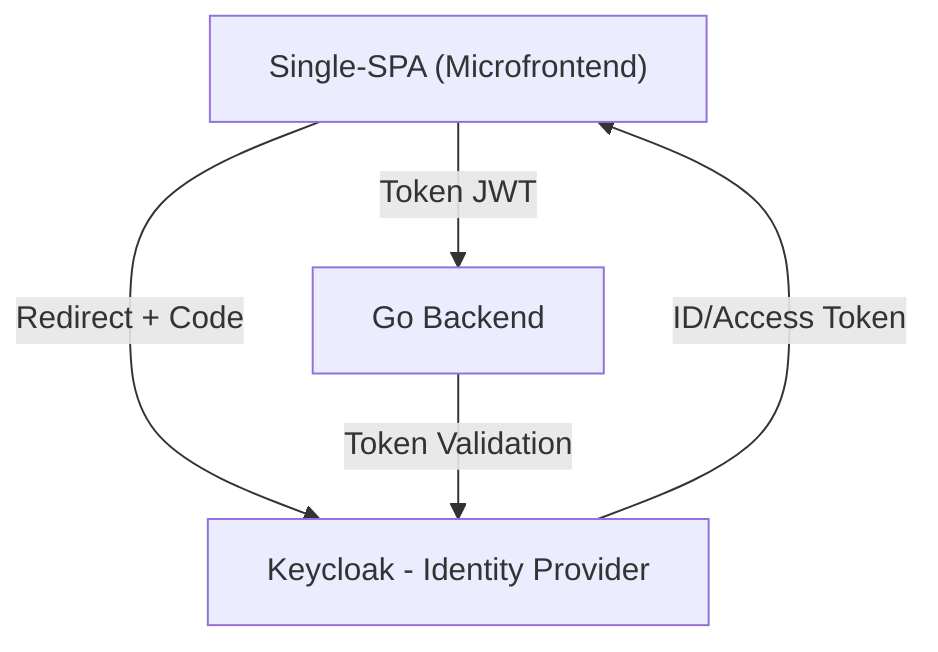

# 🔐 Sistema de Autenticação com Golang + Keycloak + Microfrontend

Este projeto demonstra a implementação de um sistema de login robusto utilizando **Golang (Go)** como backend, **Keycloak** como provedor de identidade (IdP) via **OIDC**, e **Single-SPA** para orquestração de microfrontends seguros.

---

## 🧱 Arquitetura



---

## 🚀 Tecnologias Utilizadas

- **Golang** — Backend seguro e performático
- **Keycloak** — Open Source Identity Provider
- **OAuth2 / OpenID Connect** — Protocolo de autenticação
- **Single-SPA** — Microfrontend Framework
- **JavaScript / React** — Microfrontends de login e dashboard
- **Docker** — Ambiente local de Keycloak

---

## 📌 Funcionalidades

- ✅ Autenticação via Authorization Code Flow (PKCE)
- ✅ Validação de tokens no backend Go
- ✅ Integração segura com microfrontends SPA
- ✅ Redirecionamento seguro e controle de sessão
- ✅ Backend extensível com middleware para rotas protegidas

---

## 🛠️ Instalação

### 1. Clonar o projeto

```bash
git clone https://github.com/luansantosco/go-keycloak-microfrontend.git
cd goauth
```

### 2. Subir Keycloak com Docker

```bash
docker run -p 8080:8080 \
  -e KEYCLOAK_ADMIN=admin \
  -e KEYCLOAK_ADMIN_PASSWORD=admin \
  quay.io/keycloak/keycloak:24.0.1 start-dev
```

### 3. Rodar o backend Go

```bash
cd backend
go run main.go
```

### 4. Rodar os microfrontends SPA

```bash
cd spa-root
npm install
npm run start
```

---

## 📂 Estrutura do Projeto

```
goauth/
├── backend/         # Código Go com autenticação OIDC
├── spa-root/        # Configuração Single-SPA (root)
├── mfe-login/       # Microfrontend de Login
├── mfe-dashboard/   # Microfrontend principal
└── README.md
```

---

## 🧠 Para Estudo

Este projeto está sendo desenvolvido com foco **educacional e prático**, explorando o funcionamento interno de autenticação federada, validação de tokens e controle de sessão entre múltiplos microfrontends desacoplados. Cada etapa é acompanhada de explicações para facilitar a compreensão de arquiteturas modernas.

---

## 👨‍💻 Autor

**Luan Santos**  
Frontend Developer | Backend Go Developer    
Pós-graduando em Cybersecurity pela Acadi-TI

[🔗 LinkedIn](https://www.linkedin.com/in/luansantosco)  
[💻 GitHub](https://github.com/luansantosco)

---

## 📄 Licença

Distribuído sob a licença MIT. Veja `LICENSE` para mais informações.
